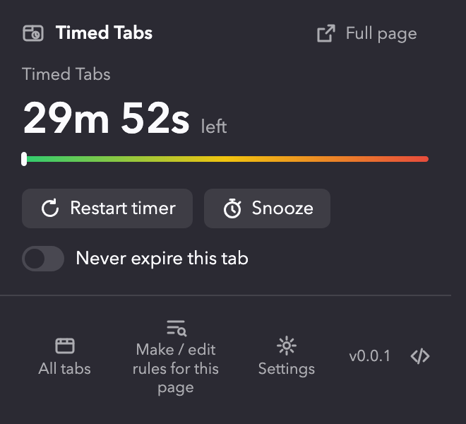
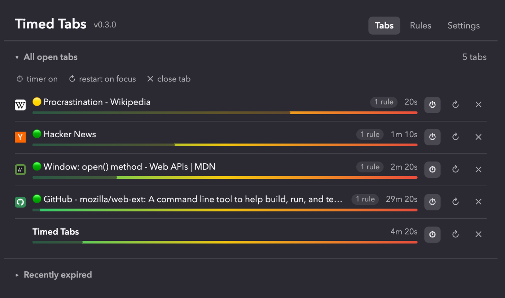
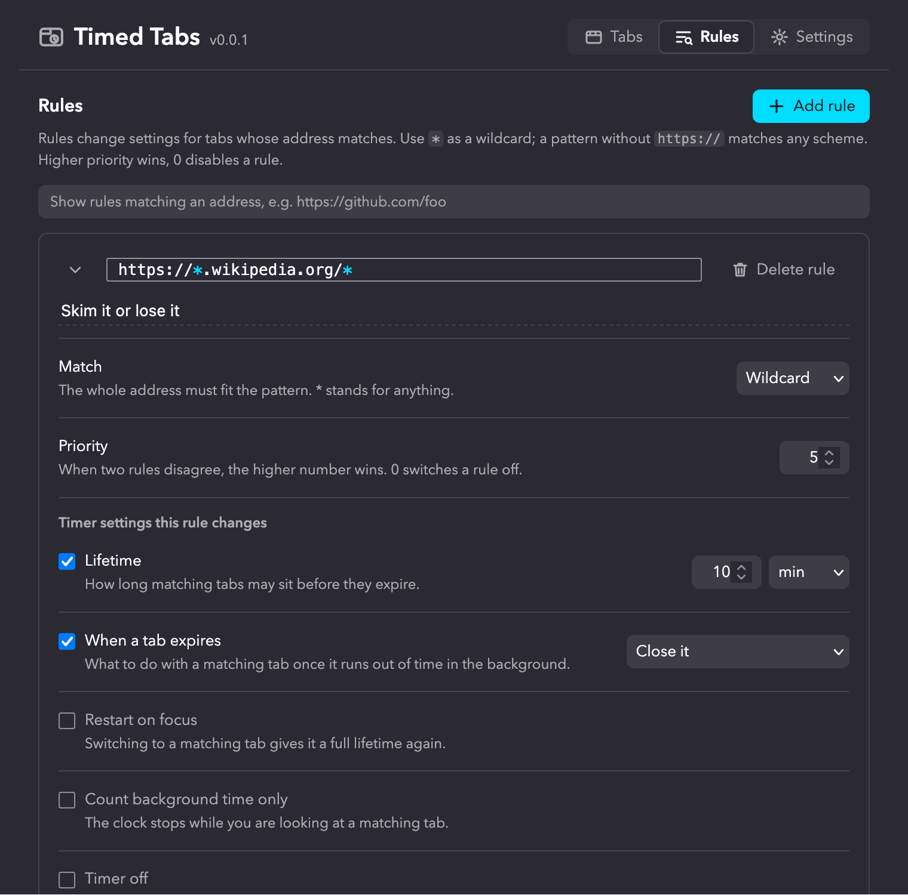
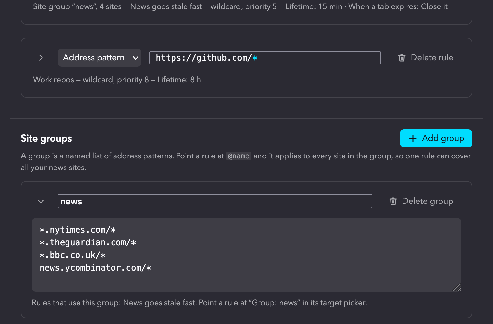
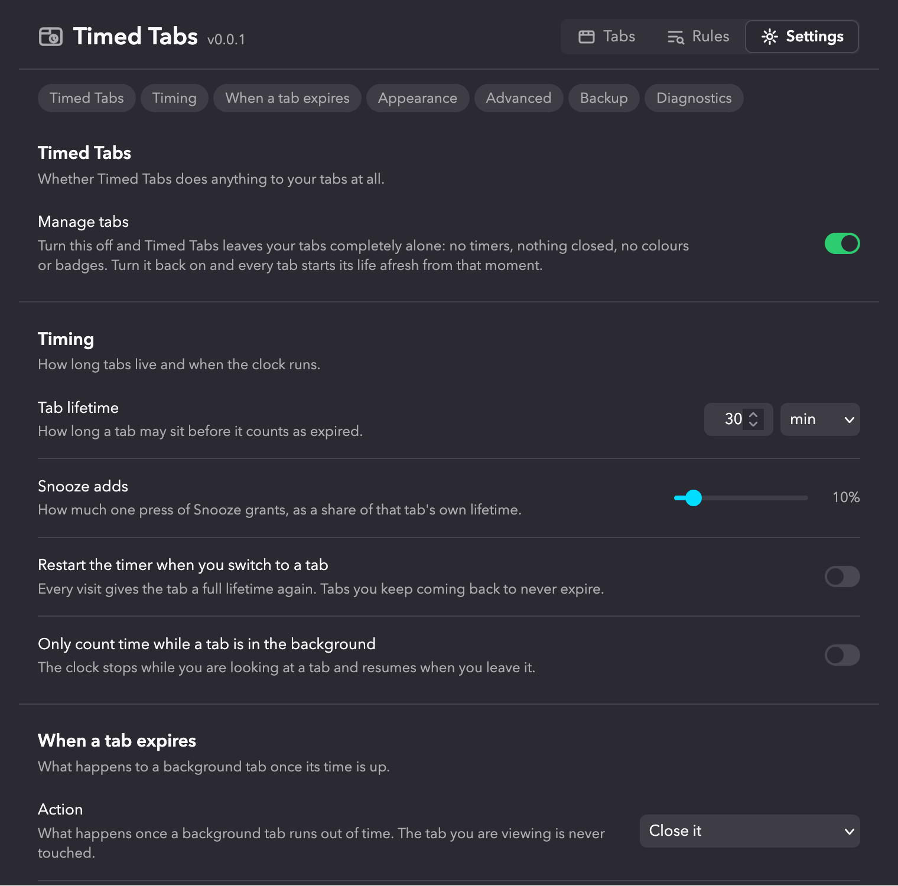

# Features

Timed Tabs gives every tab an expiry timer, shows how much of it is left, and does
something about the tab when the time is up. Everything happens inside the browser;
there is no account and no server.

> 🚧 **Beta.** Every release is a snapshot of `main`, published as a pre-release, so
> what is described here can still change between builds. See [🚧 Betas](#-betas).

## Contents

- [⏳ The timer](#-the-timer)
- [🔔 What happens at zero](#-what-happens-at-zero)
- [🎨 Seeing the time left](#-seeing-the-time-left)
- [🪟 The popup](#-the-popup)
- [📑 The Tabs page](#-the-tabs-page)
- [📋 Rules](#-rules)
- [🗂️ Site groups](#-site-groups)
- [⚙️ Settings](#-settings)
- [🔒 Privacy and permissions](#-privacy-and-permissions)
- [🦊 Firefox and Chrome](#-firefox-and-chrome)
- [🚧 Betas](#-betas)

## ⏳ The timer

Every tab starts a clock the moment it appears. The default lifetime is 30 minutes,
set under Settings, Timing. Two settings change when the clock runs:

- **Restart the timer when you switch to a tab.** Every visit gives the tab a full
  lifetime again, so tabs you keep coming back to never expire.
- **Only count time while a tab is in the background.** The clock stops while you
  are looking at a tab and resumes when you leave it.

Pinned tabs are left alone. So is the tab you are looking at: whatever the expiry
action is, it never touches the active tab.

## 🔔 What happens at zero

Settings, When a tab expires, has one action for every background tab that runs
out of time:

- **Leave it open.** The colours show it has expired; nothing else changes.
- **Reload it, restart the timer.** Useful for dashboards and feeds.
- **Unload it.** The tab stays in the strip but frees its memory.
- **Close it.** The tab goes, and lands in the Recently expired list.

With **Tell me when a tab is closed** on, a desktop notification names each tab that
was closed. Several tabs closed on the same tick share one notification. Clicking it
reopens the tab when there was one, and opens the Tabs page when there were more.
This needs the browser's notification permission, which is asked for when the setting
is switched on.

## 🎨 Seeing the time left

Settings, Appearance, offers four indicators. Use any combination. Colour runs
green, yellow, red as time runs out.

- **Colour every tab's favicon.** The icon gets a coloured square, ring or dot,
  chosen under Favicon colour style. Works on every tab.
- **Coloured dot in the tab title.** A 🟢 🟡 🟠 🔴 dot in front of the page title.
  History entries show it too.
- **Tint the active tab.** The background of the tab you are viewing takes the
  colour. Firefox only.
- **Minutes left on the toolbar button.** The Timed Tabs button shows the minutes
  left for the current tab.

Two settings soften the display. **Flash when a tab is about to expire** makes every
indicator blink during the last stretch, by default the final minute. **Leave fresh
tabs alone** shows nothing until a tab has used part of its lifetime, 40% by default,
so recently opened tabs look like ordinary tabs.

## 🪟 The popup

The toolbar button opens a small panel for the current tab.



- The time left, with a bar you can drag to set the tab's used share anywhere
  between 2% and 100%.
- **Restart timer** gives the tab a full lifetime.
- **Snooze** adds a share of the tab's own lifetime, 10% by default, set under
  Settings, Timing, Snooze adds.
- **Never expire this tab** takes the tab out of the timer for as long as it is open.
- When rules match the page, they are listed with a switch to ignore each one for
  this tab, and a switch to ignore all of them. These choices last until the tab is
  closed.
- **Full page** in the header opens the Tabs, Rules and Settings pages. The footer
  shows the version and links to the source code.

## 📑 The Tabs page



All open tabs, grouped by window, with the active window first. Each row shows the
favicon, the title, how many rules match, the time left and a bar of the lifetime
used. The buttons on the right snooze the tab, turn its timer on or off, toggle
restart-on-focus, and close it. Closing asks for a second click.

**Order by** sorts within each window by tab order, time left or percent left, and
the choice is remembered.

**Recently expired** lists the tabs Timed Tabs closed, for a day by default. Each row
keeps the site's icon and can be reopened. A page that keeps expiring shows once
with a count and the time it was last closed. Rows can be removed one at a time, or
the whole list cleared.

## 📋 Rules



A rule changes settings for tabs whose address matches a pattern. Rules are
re-evaluated whenever a tab navigates, so a tab that moves from one site to another
picks up the other site's rules.

- **Patterns** use `*` as a wildcard. A pattern without `https://` matches any scheme.
  Wildcards are shown in colour so they stand out. New rules start with `https://`.
- **Match** is either the whole address against the pattern, or "starts with".
- **Priority** runs from 0 to 10. When two rules disagree, the higher number wins,
  and 0 switches a rule off.
- **Timer settings** a rule can change: lifetime, the expiry action, restart on
  focus, count background time only, and timer off.
- **Appearance** a rule can change: which indicators are used, the favicon style,
  leave fresh tabs alone and its threshold, and flashing with its lead time. The
  global settings stay the default; a rule only replaces what it sets.

The rules list is sorted by pattern. A filter box shows only the rules that match an
address, and **Add rule** starts one for the filtered site and scrolls to it.

## 🗂️ Site groups

Site groups are behind the **Site groups** feature flag under Settings, Feature
flags. A group is a named list of address patterns, and a rule can target the group
instead of one address. The rule then applies to every site in the group.



Take news sites as the example. You read five or six of them, none of them deserves
more than fifteen minutes, and without groups that is six rules that all say the same
thing. With groups it is one list and one rule:

1. On the Rules page, press **Add group**, name it `news`, and list the sites one per
   line:

   ```
   *.nytimes.com/*
   *.theguardian.com/*
   *.bbc.co.uk/*
   news.ycombinator.com/*
   ```

2. Press **Add rule**, and in the picker beside the pattern field choose
   **Group: news**. Set the lifetime to 15 minutes and the expiry action to close.

A new news site is one more line in the group, not another rule. Group entries are
wildcard patterns with the same rules as a rule's own pattern, so a pattern without
`https://` matches any scheme.

Some details worth knowing:

- A rule stores its target as `@news`, which is how it appears in a backup and in the
  popup's list of rules for the page. Renaming a group updates every rule that points
  at it.
- A group cannot be deleted while a rule still uses it.
- Priority works as it does for any rule. A rule on one address can still beat the
  group's rule by carrying a higher number.
- With the flag off, rules that target a group match nothing, and their cards say so.

## ⚙️ Settings



Settings save as soon as they change and show a Saved mark. Settings sync
through the browser's extension storage; rules are kept locally.

- **Manage tabs** is the master switch. Off leaves every tab alone, with no timers,
  no closing and no colours, and undoes every mark already made. Back on, every tab
  starts its life afresh from that moment.
- **Backup** exports every setting and every rule as one JSON document, to copy or
  download, and loads one back. Loading replaces everything.
- **Diagnostics** shows what the background is doing for each tab, which is useful
  when an indicator does not seem to paint.
- **Refresh every** sets how often colours and badges update, 5 seconds by default.

## 🔒 Privacy and permissions

The manifest declares no data collection. Timed Tabs asks for access to all sites
because the favicon and title indicators run a small script in each page to change
its icon or title; nothing is read from the page. Notifications are an optional
permission, asked for only when the setting is turned on.

[privacy.md](privacy.md) covers what is stored on your machine,
how long the recently expired list keeps the addresses of closed tabs, and what to do
about private windows.

## 🦊 Firefox and Chrome

Firefox 140 or later is the primary target. Firefox for Android is not declared yet;
see the [road map](../road-map.md). Chrome builds are produced from the same source; the tab tint indicator is
Firefox only because Chrome has no theme API for it.

## 🚧 Betas

While the project is in development, each release is a beta. A beta shows a yellow
BETA badge beside the title and is listed as "Timed Tabs Beta" in the add-ons
manager. See [developer/releasing.md](../developer/releasing.md).
